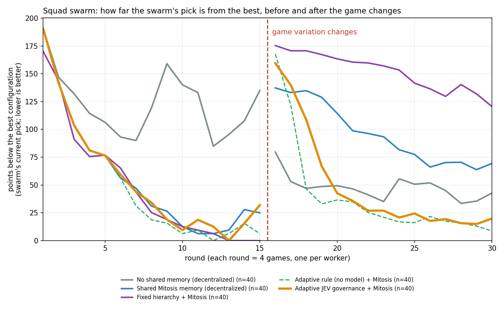

# Full write-up: one model, three jobs

The long version of the [README](../README.md): every table, the falsification ladder, the Eval and Squad studies, and the swarm experiment in detail.

Entry for the UFA JEV Bake-Off (Space Invaders). **Track: Pilot.** JEV chooses every move.

The same model (jev-1.13.0) also appears in the two other roles the Bake-Off describes, as a case study in what a fast decision model is and isn't good for:

| Job | Bake-Off track it illustrates | Headline |
|---|---|---|
| **Player:** every move | Pilot (our entry) | **709** mean on 100 untouched seeds; 2.2x a sweep bot; beat Haiku 4.5 5/5 turn-based and 19/20 in real time. $0.034 per game, 101 ms per decision. |
| **The exam:** exact right/wrong labels for single decisions | Eval | On 500 unseen life-or-death moments: JEV 97.8% vs Haiku 95.8% with the same view, at 1/9 the latency and 1/48 the cost. |
| **Lab manager:** which configuration gets the next games, and when to stop | Squad | JEV 92.5% right winner (98% with memory), Haiku 95%. The same Mitosis memory dropped Haiku to 40%. |

**The story version:** `site/` is a scroll-through page of the same results (every number is generated from the files in this repo by `site/tools/build_data.py`). View it with `python -m http.server -d site` and open http://localhost:8000; `?demo=1` plays a short presentation cut (about 1 minute 45 seconds; arrow keys step through scenes).

**What we learned:** JEV is a fast, cheap chooser, but it needs the right facts. From a raw bullet list it was barely better than random on life-or-death moments (76% vs 65%). Told which moves are safe, it was right 98% of the time. Every claim below comes with the command that reproduces it.

## 1. Player (Pilot)

`ALE/SpaceInvaders-v5` (RAM observations) → extractor → a short JSON view (~200 characters) → one JEV `choice` question → one of the six actions, every step.

- The view (`threat_safe`) contains:
  - ship x, lives, and whether a shot is ready;
  - the 3 nearest falling bullets (dx, dy);
  - the horizontal offset to the nearest invader, and whether one is directly above;
  - `move_is_safe`: for LEFT / STAY / RIGHT, whether any falling bullet would reach the ship within 12 steps if it moved that way. This comes from measured physics: ship 2 px/step, bullets ~4 px/step, and shields block.
- The question (`sweep_words_v1`) lists the six actions. Its instruction says to keep moving steadily in one direction, to reverse only at the edge or to dodge a bullet, and to shoot whenever the shot is ready.
- **JEV picks every move.** Code computes the facts in the view but never chooses an action.

**Holdout.** These 100 seeds were drawn once with `secrets.SystemRandom` and never used during development (`ufa/experiments/seeds_holdout.json`). The configuration was frozen first; the holdout was run once.

| Player | Games | Mean | Without bonus ship | Median | Paired difference | $ per game | p50 per decision |
|---|---|---|---|---|---|---|---|
| **JEV (final)** | 100 | **709** | 565 | 620 | vs sweep: +383 [+328, +442], won 92/100 | $0.034 | 101 ms |
| Claude Haiku 4.5, same view and question | 5 (first 5 seeds) | 364 | 244 | 420 | JEV vs Haiku on those seeds: +390 [+211, +665], won 5/5 | $0.99 | 957 ms |
| Sweep bot (no model) | 100 | 326 | 280 | 320 | reference | $0 | - |
| Random | 100 | 143 | 133 | 120 | vs sweep: -182 | $0 | - |

- Brackets are 95% bootstrap intervals of the paired per-seed difference.
- **Development estimate vs holdout:** 711 on 50 development seeds against 709 on the holdout.
- **Real-time clock** (`exp009`, first 20 holdout seeds). The game does not wait: while the model thinks, the previous action keeps playing.

| Player | Mean | Decisions per game |
|---|---|---|
| JEV | 441 | 531 |
| Haiku 4.5 | 110 | 33 |
| Sweep bot | 334 | - |

  JEV beat Haiku on 19 of 20 seeds, by +331 [+252, +412].

**How we got there.** A falsification ladder on 300 separate development seeds. Each step changed one thing, with paired seeds and successive halving:

| Belief | Result | Evidence |
|---|---|---|
| The view barely matters; JEV is the model | FALSIFIED | exp002: RAW 110 vs THREAT 331, same model |
| THREAT wins because of its hints | FALSIFIED | exp003: RAW+hints 163 < RAW 190 < THREAT 299 |
| It wins by hiding at the left wall | FALSIFIED | exp004: left-wall bot = 180 on all 205 seeds |
| JEV THREAT beats a dumb sweep bot | FALSIFIED | exp005: -3 [-39,+34] without bonus, 50 new seeds |
| JEV can't judge incoming bullets itself | SURVIVED | 261 critical moments: 64% (chance 63%) |
| Tell it which moves are safe, not where bullets are | SURVIVED | 95% on critical moments; +116 [+88,+143] on 50 dev seeds |
| Wording doesn't matter once the view is right | FALSIFIED | sweep wording: +48 n.s. on THREAT, +156 [+107,+211] on SAFE (50 dev seeds) |
| It holds on seeds we never looked at | SURVIVED | 100-seed holdout, run once: 709 (dev 711); +285 [+247,+326] vs sweep ex-bonus |
| Memory makes the lab manager better | DEPENDS | same Mitosis memory: JEV 92% -> 98% (n.s.); Haiku 95% -> 40% (p=0.003) |
| Similar past moments help JEV decide | FALSIFIED | 76% -> 77% on 500 unseen moments; +3.7 s per decision |

## 2. The exam (Eval)

`ufa/analysis/decision_bench.py` snapshots the emulator at a game moment and plays each of the six actions out from that exact state. The labels are therefore exact: a move either survives or loses a life.

- **"Critical" moments** are the ones where at least one move survives and at least one doesn't.
- **Development set:** 996 moments from 280 development games. Used for building and for memory.
- **Test set:** 1,170 moments from the 200 turn-based holdout games. Built only after the holdout was run and frozen; the builder refuses holdout traces otherwise.
- Every decider sees the same 500-moment sample (fixed seed) from the test set.

| Decider, view | Chose a surviving move (chance 65.3%) | Confidence AUC | p50 latency | Cost per decision |
|---|---|---|---|---|
| **JEV, safe view** | **97.8%** | 0.66 | **102 ms** | **$0.000024** |
| JEV, raw bullet list (THREAT) | 76.0% | 0.69 | 111 ms | $0.000024 |
| Haiku 4.5, safe view | 95.8% | 0.61 | 951 ms | $0.00114 |
| Haiku 4.5, THREAT | 97.2% | 0.79 | 944 ms | $0.00114 |

- On the full 1,170 moments, JEV scores 96.9% (safe view) and 76.2% (THREAT).
- The `move_is_safe` flag itself agrees with the emulator on 92.6% of test moments.

**With memory.**
- **Setup:** the 996 labelled development moments are stored in a Mitosis Cortex memory. Before each test decision, the 3 most similar past moments and their surviving moves are added to JEV's view.
- **Result:** no improvement. THREAT went from 76.0% to 77.0% (65 answers fixed, 60 broken, p = 0.72; a plain rerun alone flips 63). The safe view went from 97.8% to 97.4%.
- **Cost:** retrieval adds about 3.7 s per decision.
- Memory does not belong inside a 100 ms decision loop.

## 3. Lab manager (Squad)

The job we did by hand to find the player: several candidate configurations, a game budget, and each game costs money. Which configuration gets the next games, and when do you stop?

- **Manager setup:** in `ufa/squad/lab_manager.py`, JEV answers two typed questions:
  1. "Which configuration gets the next 3 paired games, or STOP?"
  2. At the end: "Which configuration is best?"
  Code only runs the games it chose, and computes facts such as `untested` and `could_be_best`.
- **Replayed games:** every game is a real recorded game (140 in round 2), replayed with the seed order shuffled per trial. Trials are paired across managers.
- **Tuning:** the manager's wording and state were tuned on round 1 only. Round 2 is the test.
- **Memory:** round-1 findings, written to a Mitosis Cortex memory (with attribution) and retrieved per configuration before planning.

| Manager (round 2: 7 configurations, budget 36 games) | Found the true best | Games spent | Time per decision |
|---|---|---|---|
| Halving rule (no model) | 94% | 31.0 | - |
| Equal games (no model) | 88% | 36.0 | - |
| Haiku 4.5 | 95% | 35.1 | 1,258 ms |
| Haiku 4.5 + Mitosis memory | **40%** | 11.2 | 1,550 ms |
| JEV | 92.5% | 28.4 | 108 ms |
| **JEV + Mitosis memory** | **97.5%** | 31.1 | 108 ms |

- **Memory helped JEV slightly:** 3 trials fixed, 1 broken, not significant on 40 paired trials.
- **Memory hurt Haiku badly:** 12 trials broken, 1 fixed, p = 0.003. Haiku read "the safe view beat the reference" (a round-1 finding about a different baseline) as "safe is the best here", and stopped after one run.
- **Takeaway:** the same evidence helps or hurts depending on who reads it.
- **Honest ceiling:** on round 1 the halving rule was perfect and JEV reached 90%. A planning decision made a dozen times per search is not where a 100 ms model shines. Thousands of decisions per game is.

## 4. Swarm with shared memory (Squad side study)

A second Squad experiment, separate from the competition results. Pre-registered in `ufa/squad/swarm/PREREG.md`.

- **The search:** 4 workers look for the best of 12 rule-based player setups (movement × dodging × firing). Each round, each worker plays one real game.
- **The twist:** after 15 rounds the game changes to another official variation (game mode 1). The old winner drops to 7th of 12.
- **Ephemeral workers:** each worker is retired every 5 rounds, and all four at the change. Without shared memory, what a worker learned dies with it.
- **Shared memory:** findings go to Mitosis Cortex (config, game version, games, mean, confidence interval, status, provenance). Inherited findings are evidence, not facts: JEV can mark one CHALLENGED, and it then stops counting.
- **JEV's job:** each round, three typed choices: EXPLORE or COORDINATE; which inherited finding is contradicted (or NONE); and STOP or not (recorded, never acted on).



**Main run** (40 paired trials per condition; games replayed from 960 real games played on Tenki). Numbers are the average points the swarm's current pick is below the best setup (lower is better):

| Condition | Before the change | After the change |
|---|---|---|
| Workers alone, no memory | 123 | 48 |
| Workers + Mitosis memory | 56 | 96 |
| Fixed coordinator + memory | 49 | 152 |
| JEV governance + memory | 56 | 49 |
| JEV governance, no memory | 123 | 48 |
| Simple threshold rule + memory | 51 | 40 |

- **Memory helps first:** -67 [-77, -57] before the change (39/40 trials).
- **Then it drags:** +48 [+27, +70] after the change.
- **JEV removed the drag, but a simple rule did it slightly better** (rule won 33/40 trials).

**Tenki-native validation** (`ufa/squad/swarm_tenki.py`, run `v4`: 10 fresh-seed paired trials of JEV + memory vs JEV without memory):

- **Layout:** one Tenki coordinator sandbox runs the round loop, reads and writes Mitosis and asks JEV. Four Tenki worker sandboxes play every game. A worker is destroyed and replaced by a brand-new sandbox exactly when the design retires it: 30 worker sandboxes, 2,400 games, 1 retried call.
- **Workers hold no key.** The memoryless swarm's knowledge lives on its workers' own disks, so it really dies with them. Every new worker was checked at birth and knew nothing.
- **Replay:** 150 sampled games re-derived locally from seed and action log: 150/150 matched.
- **Memory still helped first:** -33 [-51, -15] before the change (9/10 trials).
- **The drag came back even with JEV:** +35 [+17, +52] after the change (8/10). In the main run JEV had removed it.
- **Why, most likely:** the memory read. We read a trial's findings with a search (`/v1/answer`, top 40) over a feed shared by 10 trials. In 92% of reads at least one of the trial's own findings was not returned; returned findings were never out of date. So JEV often could not see the stale finding it needed to challenge (first stale challenge: round 8.5 vs 2.5 in the main run). The main run had the same limit, less often (about a third of reads).

**JEV robustness audits** (on saved states; they never drove a live decision; `ufa/squad/jev_audit.py`):

| Audit | Result |
|---|---|
| 3 separate requests vs one request with 3 questions over the same state | Same answers within repeat noise (e.g. stop 100%, mode 86% vs 87% repeat-to-repeat); half the input tokens (1,252 vs 2,550); 89 vs 197 ms |
| Option order: explore vs coordinate | Flipped 29% of borderline states vs 8% on a plain repeat; the option listed last gains about 7 points |
| Option order: which finding is contradicted | 17% flips vs 12.5% repeat noise |
| Option order: stop | No flips |
| Stop, against truth | JEV never said stop (p(yes) about 0.02) whether or not the leader was truly best |

`confidence` in the API is a spread summary of the distribution ((p_max - 1/K)/(1 - 1/K)), not a probability of being right, so every probability above comes from the returned distributions.

## Sponsor stack

- **JEV (TypeSafe System One):** every move; the manager's decisions in the Squad study.
- **Tenki:**
  - **Tournament furnace:** `ufa/tenki/remote_batch.py` shards games across 5 sandboxes. 60 of the 100 holdout games and 30 of the finalist's development games ran there. Only the JEV key goes to workers, with no inbound network.
  - **Ephemeral swarm:** in the swarm validation, Tenki sandboxes are the swarm's population. A coordinator sandbox creates and destroys four worker sandboxes on the experiment's own schedule (31 sandboxes in the validation run). Worker death is real: a replaced sandbox and everything on its disk are gone.
  - **Replay CI:** `.github/workflows/tenki-replay.yml`. On manual dispatch (or a push to main that changes the results or game code) it replays every game in `results.json` from seed and action log in fresh Tenki sandboxes (no model, no model key), checks `results.json` against the replays, and posts the score. Latest run: 305/305 games matched, taking 33 s and costing $0.006.
- **Mitosis Cortex:**
  - the lab's memory, in a dedicated memory separate from any personal data;
  - holds the round-1 findings (with attribution) and 996 labelled moments;
  - retrieved with sources by the lab manager and by the memory Eval (`ufa/mitosis/cortex.py`, plain HTTP);
  - the swarm's shared memory: the only way a finding survives a worker's death. Without it the swarm's search error roughly doubles before the game changes.
- **Claude Haiku 4.5:** the LLM baseline in all three jobs, through the System One adapter with the identical view and questions.

## Reproduce

Python 3.12+.

```bash
pip install -r requirements.txt
```

```bash
python -m ufa.verify_replay check replays/holdout.json
```

```bash
python -m ufa.ci_check --results results.json --replays replays/holdout.json
```

```bash
python -m ufa.local_batch --config ufa/experiments/exp008_holdout.json --arms jev_final --seeds-file ufa/experiments/seeds_holdout.json --holdout --parallel 8
```

```bash
python -m ufa.analysis.decision_bench eval --bench bench/test_holdout_c8.json --backend jev --model jev-latest --representation threat_safe --sample 500 --out eval_jev_safe.json
```

```bash
python -m ufa.squad.lab_manager run --pool ufa/squad/pool_dev20.json --round 2 --manager jev --state v3 --memory off --trials 40
```

1. The first two commands need no key. They re-derive every score in `results.json` from the logged actions, and check `results.json` against the replays.
2. The next three need `TYPESAFE_API_KEY`. They play new holdout games, run the Eval on the test set, and run the lab manager. JEV is not deterministic, so results vary around the reported ones.
3. The Haiku rows need `ANTHROPIC_API_KEY`: use `--backend llm --model claude-haiku-4-5`, or `--manager haiku`.
4. The memory rows need a Mitosis key and memory id (`MI_API_KEY`, `MITOSIS_OFFICE_ID`). Fill the memory first:
   - `python -m ufa.squad.lab_manager remember`
   - `python -m ufa.analysis.decision_bench memorize --bench bench/critical_dev_sweep280_c8.json`
   Then pass `--memory on` or `--memory-feed bench_dev_cases`.
5. Optional: `python -m ufa.tenki.verify --replays replays/holdout.json --shards 5` runs the replay check in clean Tenki sandboxes. It needs `TENKI_API_KEY`. `ufa.ci_check` exits 1 on any mismatch.
6. Swarm study, from the saved runs (no key): `python -m ufa.squad.swarm_analysis --run s1` and `python -m ufa.squad.swarm_validation --run v4 --replay 150` (the second also replays 150 of the Tenki games).
7. Swarm study, live: `python -m ufa.squad.swarm run --conds A,B,C,D,E,F --trials 40 --first-trial 100 --run <new id>` (landscape replay; needs the JEV and Mitosis keys), or `python -m ufa.squad.swarm_tenki launch --run <new id> --conds D,E --trials 10` (all on Tenki; also needs `TENKI_API_KEY`).

`results.json` holds per-game records: seed, score, steps, calls, tokens, latency, cost and the served model. The `analysis/`, `bench/results/` and `squad/results/` folders hold every summary quoted here.

## Limits

- **Turn-based clock:** the environment waits for each decision (the default). In real time JEV scores lower (441). There it clearly beats Haiku, but not significantly beats the sweep bot: +107 [-3, +218] on 20 seeds.
- **`move_is_safe` is hand-written code:** a 12-step projection from measured physics. It agrees with the emulator 85-93% of the time on critical moments.
- **Small samples:**
  - The turn-based Haiku game comparison is 5 games, limited by cost.
  - The Squad study replays one tournament's games, with 20-40 trials per model condition.
- **Swarm study:**
  - its players are rule-based setups (JEV governs the swarm, it does not fly the ship);
  - one game change; the threshold rule was written by us alongside JEV's questions;
  - the Tenki validation is 10 trials per condition, and its memory read was incomplete (see section 4);
  - Tenki capacity failures stopped three earlier validation attempts before any trial finished (`ufa/squad/swarm/validation/attempts.json`).
- **Bonus-ship points are mostly luck,** so every comparison is also reported without them.
- **JEV is not deterministic.** Replays prove the recorded games; new runs vary around the mean (SD 254). Real-time games depend on wall-clock latency and are not replay-verified.

## License

MIT for the code and data in this repository; see [LICENSE](../LICENSE) for what it does not cover.
